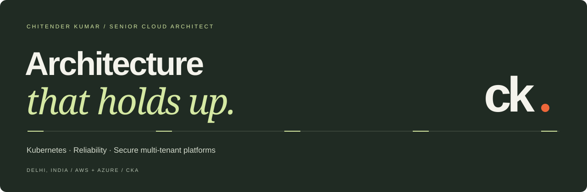

  

  <a href="https://www.linkedin.com/in/chitenderkumar/">LinkedIn</a> ·
  <a href="mailto:chitenderkumar.16@gmail.com">Email me</a> ·
  <a href="https://chitender.github.io/learn-k8s/">Explore learn-k8s</a> ·
  <a href="./PORTFOLIO.md">Interactive portfolio & setup</a>

## I build platforms that teams can trust.

I'm **Chitender Kumar**, a **Senior Cloud Architect at Innovaccer**, based in Delhi, India. My work connects cloud architecture, Kubernetes operators, configuration governance, observability, and the realities of being on call across **AWS, Azure, and Azure Government**.

I work from architecture and executable specifications through implementation, investigation and review. For AI-assisted builds, my contribution includes defining the system, reviewing the engineering decisions, and integrating and validating the result.

**Focus:** Cloud architecture · Staff / Principal platform engineering · SRE · AI-assisted operations

**Credentials:** Certified Kubernetes Administrator (CKA) · B.Tech, Computer Science, LDIET

## Selected engineering stories

| Project | My contribution and engineering depth | Delivery status |
| :--- | :--- | :--- |
| **TCMS** | Architecture and AI-assisted implementation of a governed configuration write path: schema validation, independent approvals, immutable PostgreSQL revisions, an outbox publisher, etcd projection, and disjoint writer permissions | Implemented and integration-tested; rollout pending |
| **InfraInsights** | On-call/escalation ownership, operational fixes and acceptance testing within a team-built observability platform; queue-based health-check scaling and notification workflows | Internal platform; adoption and MTTR improvements unquantified |
| **[Hermes](https://github.com/chitender/hermes)** | Primary maintenance and engineering of a Vault→etcd operator: templated JSON, version-change detection, reconciliation and metrics | Public implementation; internal deployment reported in project notes |
| **Tenant-routed OTel SDK** | AI-assisted Python SDK extension using context-local identity, W3C baggage, fail-closed OTLP routing and exporter lifecycle controls | Implemented and tested; consumer integration pending |
| **LLM egress hub** | Shared HAProxy egress across Azure/AWS, DNS/SNI debugging and streaming-aware proxy configuration | Delivered; scoped benchmark below |
| **[learn-k8s](https://chitender.github.io/learn-k8s/)** | Interactive Kubernetes lessons that let beginners change inputs and explore scheduling, networking and reconciliation | Public learning project |

**One measured example:** HAProxy TCP passthrough reached **735 vs 534 RPS** in HTTP mode — approximately **37.6% higher throughput** in the documented single benchmark. Full test conditions were not recorded; this is not a fleet-wide or universal performance claim.

## Kubernetes, security & platform engineering

| Initiative | Engineering focus | Status |
| :--- | :--- | :--- |
| **KubeNightwatch** | TimeWindow controller with restricted-window policies, suspension/restoration, exemptions and Slack/Jira workflows | Implemented; code currently private |
| **[Kube SmartScheduler](https://github.com/chitender/kube-SmartScheduler)** | Weighted placement policies, admission mutations, drift detection and rebalancing with documented operational trade-offs | Public implementation; production adoption unverified |
| **[External Secrets: etcd provider](https://github.com/chitender/external-secrets-etcd/tree/add-etcd-provider)** | etcd SecretStore and PushSecret integration on an External Secrets Operator fork | Fork contribution; upstream merge not established |
| **Cilium & Karpenter** | Cilium networking across EKS/AKS; Karpenter capacity, instance diversity and disruption controls on EKS | Professional work; numerical rollout and savings claims awaiting verification |
| **Data services reliability** | Kafka ISR/partition/lag investigation, search-cluster operations, capacity planning and repeatable diagnostics | Professional engineering |
| **Legacy Elasticsearch hardening** | Dependency/base-image upgrades, Gradle build fixes and ECK node-set security contexts | Build and hardening documented; patched-image production rollout unverified |
| **Private connectivity & mTLS** | VPN provisioning, clinical-interface transport, NGINX Plus mutual TLS and certificate-chain diagnostics | Implementation work; customer-side VPN confirmation pending in handoff |
| **HolmesGPT toolset hardening** | Elasticsearch client compatibility, domain-guided investigation and a read-only allowlisted request tool | Branch work; not merged in handoff |

## Product builds

| Project | What I built or explored | Status |
| :--- | :--- | :--- |
| **TaskOps** | SRE task/capacity planning with deterministic commitments, separate task/support pools, interrupt reserves and MCP integration; AI-assisted application build | Team tool; code private; impact unmeasured |
| **[PatchPilot / VulnForge](https://github.com/chitender/VulnForge)** | Trivy → LLM triage → patch → GitLab MR → CI → rescan loop | Working prototype; deployment/adoption unverified |
| **Cloud Viz Mapper** | AWS resource topology and cost visibility, interactive graphs and self-hosted backend migration work | Early development; code private; no shipped multi-cloud claim |
| **InfraBlaze** | CloudFront/S3 site and API Gateway/Lambda/SES contact pipeline, automated with AWS SAM | Deployment reported; current operation not checked |
| **VITALIS** | AI-assisted backend, ingestion, explainable scoring and native iOS work, with Terraform infrastructure definitions | Personal build; Terraform not applied |
| **[MacroCut](https://github.com/chitender/macrocut)** | Goal-based planning, onboarding and daily product experience | Personal development project |

## Architecture & operating-model work

| Initiative | Design decisions | Status |
| :--- | :--- | :--- |
| **Enterprise data platform** | Shared/dedicated/customer-hosted deployment models, control/data-plane boundaries, private DNS and connectivity | Architecture delivered |
| **Tenant-aware telemetry** | Tenant propagation, cardinality-aware metrics, data controls and onboarding/routing behavior | Design and review; verification incomplete |
| **Alert Quality Engineering** | Rule hygiene, storm suppression, severity contracts, deduplication, evaluation windows and bounded automation | Analysis and plan; reductions are projections, not achieved outcomes |
| **Change-triggered smoke tests** | Dependency-aware Kubernetes Jobs triggered by image/config changes, with rollout gates and scoped RBAC | Proposal only |

**Earlier work — Aria:** historical AI-assisted incident investigation using retrieved operational knowledge. Internally deprecated according to the new project handoff; not presented as an active platform.

## Experience

| Period | Role | Company |
| :--- | :--- | :--- |
| **Jul 2024–present** | Senior Cloud Architect | **Innovaccer** |
| **From Feb 2021 → 2024** | SRE engineering & leadership | **Innovaccer** |
| Feb 2020–Jan 2021 | SDE II — Platform Engineering | Atlan |
| Jun 2019–Feb 2020 | Senior DevOps Engineer | Delhivery |
| Aug 2017–Jul 2019 | Infrastructure Engineer | Innovaccer |
| Feb 2015–Aug 2017 | Solution Architect / Engineer Operations | Telenity |

## Technical range

| Domain | Tools & practices |
| :--- | :--- |
| **Cloud & orchestration** | AWS · Azure · Azure Government · EKS · AKS · Cilium · Karpenter · Helm |
| **Controllers & configuration** | Go · client-go · controller-runtime · Vault · etcd · PostgreSQL · Outbox/revision patterns · Admission webhooks |
| **Delivery & automation** | Terraform · Ansible · Argo CD · Jenkins · GitLab CI · GitHub Actions · Python · Bash · AWS SAM |
| **Observability & reliability** | Prometheus · Thanos · Grafana · OpenTelemetry · OTLP · W3C baggage · CloudWatch · ClickHouse · SLOs · Incident command |
| **Data & products** | Kafka / MSK · Elasticsearch / OpenSearch · Redis · FastAPI · React · Node.js · MCP |
| **Security & networking** | Private connectivity · IPSec · HAProxy · mTLS · Tenant isolation · Trivy · Constrained LLM tools |

---

**Have a platform challenge or a senior technical opportunity?**

[Let's connect on LinkedIn](https://www.linkedin.com/in/chitenderkumar/) or [start a conversation by email](mailto:chitenderkumar.16@gmail.com).

The interactive portfolio contains 25 searchable project stories, an architecture explorer, theme and motion controls, and a printable recruiter brief. See <a href="./PORTFOLIO.md">setup and maintenance</a>. Project status reflects the supplied September 2026 handoff; implementation, deployment and measured impact are distinguished.
